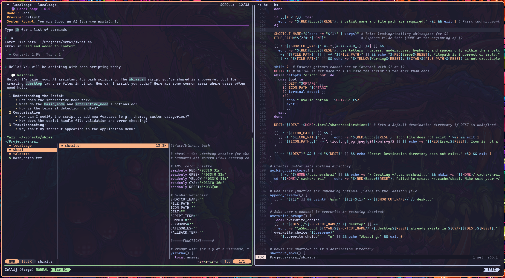

# 🔮 Local Sage
<p align="center">
  <a></a>
  <a></a>
  <a></a>
</p>

<p align="center"><b>A modern LLM chat interface that embraces the command line.</b></p>

<p align="center"></p>

<p align="center"><br><i>Local Sage running in Zellij, alongside Helix and Yazi.</i></p>

## About 🔎
Local Sage is an open-source CLI for chatting with LLMs. Not automation, not agents, just pure dialogue. Featuring **synchronous live Markdown rendering with inline math conversion** for a *silky smooth* chatting experience.

Designed to hook into any **OpenAI API endpoint**, and tested extensively with local LLMs hosted via **llama.cpp**.

#### What else makes **Local Sage** shine? ✨
- Conversations that exist right in your terminal viewport via **gorgeous live Rich panels**.
- Fancy prompts with **command completion** and **in-memory history**.
- **Context-aware file management.** See the [Under the Hood](#under-the-hood-%EF%B8%8F) section for more info!
- Lightweight, below 2000 lines of **Python** 🐍.

#### Plus everything you'd expect from a solid chat frontend.
- **Session management**: load, save, delete, reset, and summarize sessions.
- **Profile management**: save, delete, and switch between models and endpoints.
- Reasoning/Chain-of-thought support with a dedicated Reasoning panel.
- Context length monitoring via **tiktoken**, shown through a subtle status panel.

There is even a collection of [built-in Markdown themes](https://pygments.org/styles/) to choose from, courtesy of **Rich**.

## Compatibility 🔩
**Python 3.9** or later required.

The big three (**Linux, macOS,** and **Windows**) are all supported. Ensure your terminal emulator has relatively modern features. Alacritty works well. So does kitty and ghostty.

You can use non-local models with Local Sage if desired. If you set an API key, the CLI will store it safely in your OS's built-in credential manager via **keyring**.

## Installation 💽
Install **pip** for your OS, the Python package manager.

Open up your terminal and type:

```bash
pip install localsage
```

Type `localsage` into your terminal to launch the CLI. Type `!h` to view usage.

**Read through the usage tables carefully!** Proper command usage is key to configuring and using the CLI.

### Dependencies 🧰
Local Sage is designed with minimal dependencies, keeping the download light and minimizing library bloat.
- [Rich](https://github.com/Textualize/rich) - Used extensively throughout. Panels, live rendering, etc.
- [prompt_toolkit](https://github.com/prompt-toolkit/python-prompt-toolkit) - Prompts and completers, also used extensively.
- [OpenAI](https://github.com/openai/openai-python) - Provides all API interaction as well as the conversation history list.
- [keyring](https://github.com/jaraco/keyring) - Safely handles API keys on all platforms.
- [tiktoken](https://github.com/openai/tiktoken) - Provides tokenization and enables context length calculation.
- [platformdirs](https://github.com/platformdirs/platformdirs) - Detects default directories across operating systems.
- [pylatexenc](https://github.com/phfaist/pylatexenc) - Absolutely vital for live math sanitization.

### File Locations 📁
Your config file, session files, and error logs are stored in your user's data directory.

| **OS** | **Directory** |
| --- | --- |
| Linux: | ~/.local/share/LocalSage |
| macOS: | ~/Library/Application Support/LocalSage |
| Windows: | %localappdata%/LocalSage |

## Display Notes 🖥️
Typing into the terminal while streaming is active may cause visual artifacting. Avoid typing into the terminal until the current generation finishes.

A monospaced Nerd font is **HIGHLY** recommended for a seamless experience. It ensures that Markdown, math, and icons all align well on-screen. The main prompt uses a Nerd font chevron. If you want it to display correctly, **use a Nerd font**.

## Under the Hood 🛠️
#### Rendering & Streaming (For Technical Users)
At its core, Local Sage uses the **Rich** library combined with a custom math sanitizer to render live Markdown and readable inline math. Chunk processing is frame-synchronized to the refresh rate of a rich.live display, meaning that the entire rendering process occurs at a customizable interval. Effectively a hand-rolled, lightweight, synchronized rendering engine running right in your terminal.

You can adjust the refresh rate using the `!rate` command (30 FPS by default).
#### Context-Aware File Management
If you re-attach a file, context consumption is **massively reduced** by removing the original file from the conversation history and then appending the new copy. Removing an attachment (via the `!purge` command) will **fully refund** its context consumption.

This is enabled by leveraging wrappers to notate attachments and then using regex to 'snipe' them from the conversation history list.

## Limitations 🛑
Once the live panel group fills the terminal viewport, real-time rendering cannot continue due to terminal constraints. Rich.live displays an ellipsis at the bottom of the viewport to indicate that streaming continues. By default, the Response panel consumes the Reasoning panel to conserve space (toggleable with the `!consume` command).

**This should only be an issue on large responses that consume over an entire viewport's worth of vertical space.**

**Local Sage is text-only.** This limitation keeps Local Sage portable, lightweight, and backend-agnostic. Unlike text generation and file handling, the schema for image generation and attachment varies between backends.

**NOTE:** Local Sage will only ever store one API key in your keychain. If you switch providers often, you will have to swap your API key with `!key`.

## Notes & Acknowledgements 🫵
Local Sage’s math sanitizer does not attempt to fix broken LaTeX, and Rich’s Markdown parser cannot repair malformed Markdown. Please report rendering issues only if you’ve confirmed they originate from Local Sage’s math sanitizer.

Local Sage is an **open-source, single-dev project** built purely for the love of the game. Please be kind!

## Versioning 🔧
Version **1.0.0** is the fully 'finished' release, containing full CLI functionality.
- **1.0.x** - Minor patches consisting of bug fixes and aesthetic tweaks.
- **1.x.0** - Major patches consisting of feature expansions or necessary refactors.

## License ⚖️
Local Sage is released under the [**MIT License**](https://opensource.org/license/mit).

## And lastly...
I wanted to say thank you to the OSS community! Without all of your wonderful creations, I never would have had the inspiration to create something myself.

Contributions are always welcome! Please open an issue for discussion!
